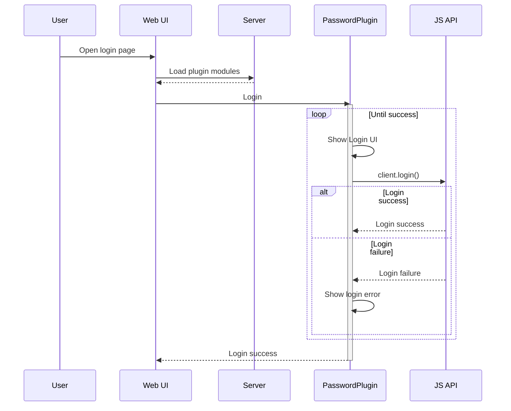
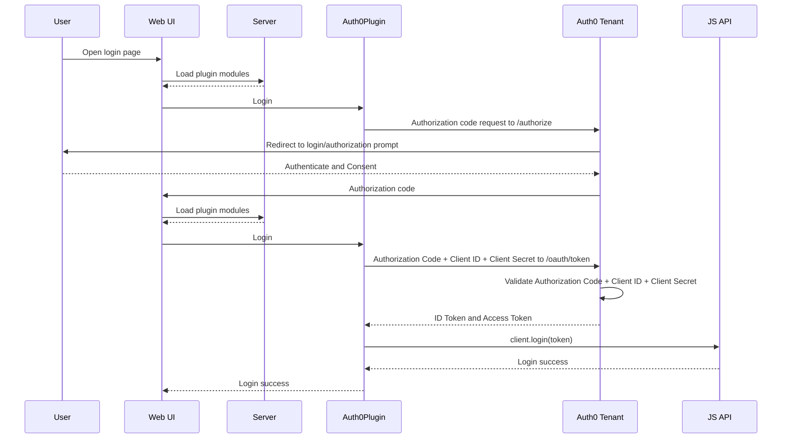

# Deephaven JavaScript Module Plugin Template

Use this Template to create a JavaScript Plugin. It is set up with TypeScript, React, ESLint, Prettier, sass, and image loader. Use this template as a starting point for creating new Deephaven JavaScript Module Plugins. Each JavaScript module may or may not include different plugin types, such as a `DashboardPlugin` or a `TablePlugin`.

## Initial Setup

After checking out this template for the first time:

1. Do an `npm install`

## Source Files

Your main source file is `src/index.ts`. It imports exports

It imports the

## Build the Plugin

```
npm run build
```

Your output will be in `dist/index.js`

## Installing the Plugin Module

TODO: Need both dev and production installation instructions

## Plugin Types

A module can optionally export one or more of the following types of plugins.

### Dashboard Plugin (`DashboardPlugin`)

Export a `DashboardPlugin` from the module to register a Dashboard Plugin. Dashboard Plugins can listen for and emit events on a Dashboard, register their own type of components for display in a Dashboard, and display their own UI overtop of a Dashboard.

### Table Plugin (`TablePlugin`)

Export a `TablePlugin` from a module to register a Table Plugin. Set the `PLUGIN_NAME` attribute on the Table with the name of the plugin module to use it:

```
t = emptyTable(5).update("X=i")
t.setAttribute("PluginName", "@deephaven/js-plugin-template")
```

### Auth Plugin (`AuthPlugin`)

Export a `AuthPlugin` from a module to register an Auth Plugin. Auth plugin can display a UI which then triggers how to login...
- Only one Auth plugin at a time? Just gives a warning if multiple plugins are given...
- Combine multiple auth plugins using a composite plugin
- The plugin will have access to the client and redux store to update data as it sees fit (or pass back workspace data to be updated?)
- Can the RefreshToken storage be part of the plugin flow somehow?
- Enterprise vs. Community difference - Enterprise currently has a lot of stuff that [it gets/sets as part of the login process](https://github.com/deephaven-ent/iris/blob/0d9ee83b3ff8b02563781bc24776176fb8269178/web/client-ui/src/login/Login.jsx#L302). Some of this stuff is Enterprise specific (e.g. creating the `WorkspaceStorage` backed by PQ, need to have some way to initialize that - could still be the app level?)

#### Example flow - User/Password login


#### Example flow - Auth0 login
Translation of flow from https://auth0.com/docs/get-started/authentication-and-authorization-flow/authorization-code-flow, showing which responsibilities login plugin handles
